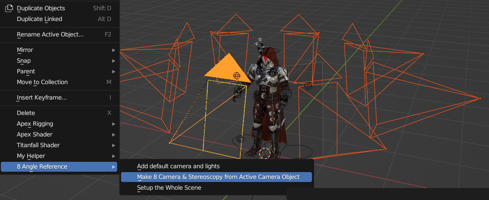

# 8-Angle-Reference-Blender-Addon

Blender addon for fast setup and rendering for 8 angle reference.

## How to Use

### Make 8 Camera & Stereoscopy

This addon uses the function in this video: https://www.youtube.com/watch?v=GX5YnybYFSI

Let's say you have an object at the origin, and a camera pointing at the object for taking reference pictures. If you want 8 reference pictures for the 8 angles (rotating 45 degrees each), you have to adjust your camera and render each pictures individually.

Given a camera, this addon can auto-generate the 8 cameras for the 8 angles. Thanks to the stereoscopy function in Blender, when you click render, all those 8 cameras can render together and you can save the 8 images as a batch.

Steps:

1. Put your object at the origin.
2. Make a camera pointing at the object's front.
3. Select the camera and choose `Right click (in 3D viewport) > 8 Angle Reference > Make 8 Camera & Stereoscopy from Active Camera Object`
    + You can see there's 8 new cameras gathered in a collection.
4. Press `F12` to render.
    + Make sure the active camera is one of those newly generated cameras. But this should be set by default.
    + After complete, you can unclick `Show stereo` to see the 8 images individually.
5. Save the images
    + If you save the image as `a.jpg`, the name of the 8 rendered images will be `a_1.jpg`, `a_2.jpg`, ..., `a_8.jpg`.
6. Enjoy your reference pictures.

Other notes:

- The cameras are generated by rotating your camera by 45 degrees (or more) related to the global Z axis.
- **THIS WILL RUIN YOUR CURRENT STEREOSCOPY!!!** If you are actually using that function then don't use this operator. If you are not then it will be fine.

### Default Camera & Light

> This is a part of some convenient features for me.

If you have a blender file with your object, you still have to set up the camera and light before you can use the `Make 8 Camera & Stereoscopy` feature. Very tiresome.

`8 Angle Reference > Add default camera and lights` will add the default camera and light for you:

- A camera, with dimension 1080x1920 (portrait), facing the +y direction.
- 2 sun light, one facing +y direction and one facing -y direction, slanted downwards.

You can adjust the camera and light to your liking. But if you know the model you have fits the default camera well (say, recent (S22~) armor model from Destiny 2 Model google drive), you can do `8 Angle Reference > Setup the Whole Scene`. It does the following:

- Add default camera and light
- Use the default camera to make 8 camera and set stereoscopy
- Set the render image type to `JPEG` (for my convenience)

So to make reference pictures you literally just click `Setup the Whole Scene`, hit F12 and save the image. How easy is that.

## Installation
Should be the same as any other addons on Github. ref. [dtzxporter/io_model_semodel](https://github.com/dtzxporter/io_model_semodel)

1. Clone this repository and zip it, or just download as zip file on Github. (`Code -> Download ZIP`)
2. `Edit -> Preferences -> Add-ons -> Install..` and choose the zip file.
3. Activate the addon by checking the box. 
   + You might have to search the addon if it is not shown automatically. (by the string `reference` or `angle`).
4. `Save Preferences`.

If you want to use newer version of this addon: uninstall the older version, reopen Blender, and do the above again. There's no cleaner way to update it to my knowledge.